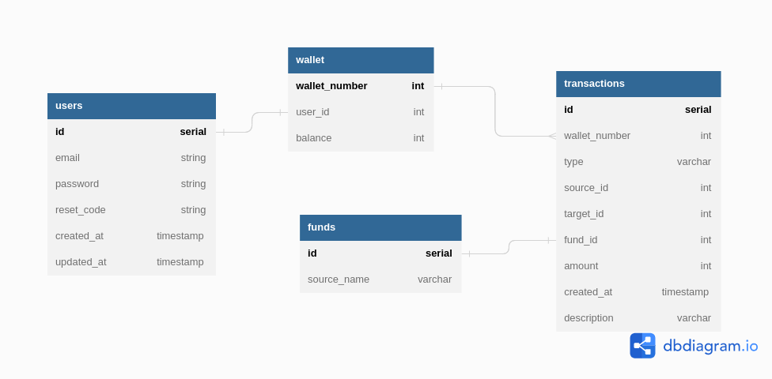

### assignment-golang-backend

Project-Description:
- The app is used for transfering funds via e-wallet that uses external entity such as bank, credit-card, and cash for its top up system.

How to set-up :
1. Setup Database, Please run the given .SQL file named *Database_Seeder.sql*
2. Run the app to start a local server 
3. You can either use an API tester software such as postman or insomnia to input manually, or you can open `/docs` in incognito mode

Completed Requirement :
1. User Register that hashes the user password into the database
2. User Login which returns a token to access specific function of the app
3. Transaction list which includes custom query for spesific sorting request
4. Top Up wallet balance
5. Transfer wallet balance to other user's wallets
6. User Personal Details

Incomplete Requirement :
1. Password Reset
2. Transaction List Pagination

